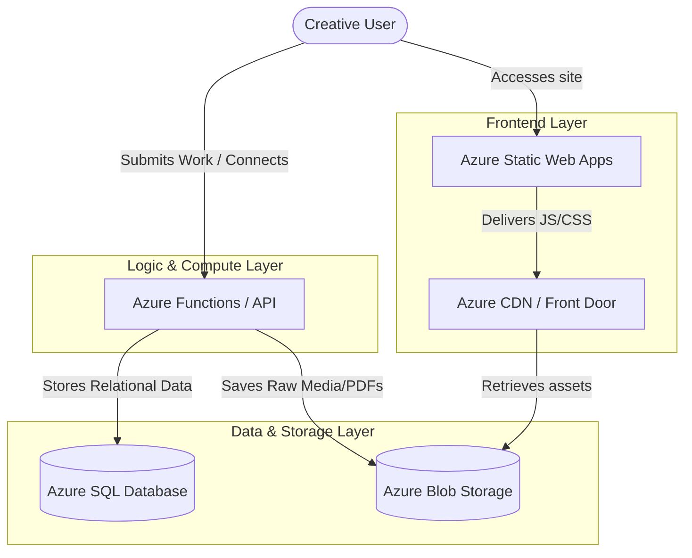

# CreativeHub - Professional Networking Platform for Creatives

CreativeHub is a high-fidelity dark-mode professional networking platform designed specifically for creative specialists (UI/UX designers, 3D artists, illustrators, motion graphics artists, and creative frontend developers). Think of it as **LinkedIn meets Behance** with a premium, sleek UI inspired by Vercel, Linear, and Raycast.

This repository serves as a **highly polished frontend prototype** built for course/internship submission, illustrating clean folder architecture, dynamic React client-state updates, and complete conceptual alignment with cloud hosting architectures.

---

## 🚀 Live Demo & Getting Started

Follow these steps to run the interactive prototype on your local machine:

1.  **Clone the Repository** and navigate to the project directory.
2.  **Install Dependencies**:
    ```bash
    npm install
    ```
3.  **Launch Dev Server**:
    ```bash
    npm run dev
    ```
4.  **Open in Browser**: Navigate to [http://localhost:3000](http://localhost:3000)

### 🔑 Evaluator Quick-Access
*   **Onboarding**: Click **"Get Started"** on the landing page to initialize a personalized creative profile, which updates the dashboard in real-time.
*   **One-Click Login**: On the `/login` screen, click the **"One-click Evaluator Login"** banner to instantly sign in as a preloaded Guest Developer profile (*Alex Mercer*), populated with connections, active jobs, and feed items.

---

## 🎨 Design Language & Aesthetic Guidelines
CreativeHub is styled with a custom dark-mode aesthetic utilizing:
*   **Grid Backgrounds**: Minimalist zinc coordinate grids (`grid-bg` inside CSS).
*   **Glassmorphism**: Backdrop blur overlays (`backdrop-filter`) for headers, modal cards, and navigation selectors.
*   **Curated Palettes**: Accent glows based on HSL tailored violets (`#8b5cf6`), dark cards (`#09090b`), and clean slate/zinc text values.
*   **Interactivity**: Complete React state binding ensuring clicking "Like", "Connect", "Apply", or uploading new projects instantly propagates changes across the header metrics, feed lists, and network graphs.

---

## ☁️ Azure Cloud Integration Architecture

While this prototype runs entirely in-memory using React Context, the service layers are structured to mock real server-side operations. Below is the conceptual architectural mapping representing how this application scales using **Microsoft Azure Services**:



### 🗄️ 1. Relational Data Store: Azure SQL Database
*   **Entities Mapped**: Users, Career Experience Timelines, Connections Mapping, Job Postings, and Feed Comments.
*   **Workflow**: When a user clicks "Connect" or "Accept Invitation", an Azure SQL query updates a self-referencing `UserConnections` table (with columns `RequesterID`, `ReceiverID`, and `Status: connected | pending`).

### 📦 2. Media & Asset Storage: Azure Blob Storage
*   **Entities Mapped**: High-resolution portfolio covers, gallery lists, and user resumes (PDFs).
*   **Workflow**: The "Share Work" action triggers a file upload. The frontend sends the file payload to an Azure Blob container utilizing a Shared Access Signature (SAS) token for secure, direct upload.

### ⚡ 3. Edge Delivery: Azure CDN / Front Door
*   **Entities Mapped**: Image-heavy portfolio pages.
*   **Workflow**: Caches Blob-hosted asset nodes globally. Designers uploading 4K renders see their pages render in sub-seconds globally since images load from localized edge points.

### ⚙️ 4. Serverless Processing: Azure Functions
*   **Entities Mapped**: Job Application Submissions, Email Digests, and Resume Matchmaking.
*   **Workflow**: Clicking "Easy Apply" triggers an HTTP-based Azure Function. This serverless process compiles the candidate portfolio details, reads the CV from Blob storage, and places a record in a processing queue for recruiters.

---

## 📁 Repository Structure

```text
creativehub/
├── public/                       # Global assets & branding
├── src/
│   ├── app/                      # Next.js App Router (Layouts & Pages)
│   │   ├── (auth)/               # Login & Signup screens
│   │   ├── (dashboard)/          # Dashboard Navigation Group
│   │   │   ├── dashboard/        # Social Feed & Post Composer
│   │   │   ├── explore/          # Behance-style project grid & modal viewer
│   │   │   ├── connections/      # Connection approvals & recommendations
│   │   │   └── jobs/             # Job board & Easy Apply dialogs
│   │   └── layout.tsx            # Global layout wrappers
│   ├── components/               # Shareable Layout UI components
│   ├── lib/
│   │   ├── AppContext.tsx        # React client state management
│   │   └── mockData.ts           # Curated developer, designer and project lists
│   └── types/
│       └── index.ts              # TypeScript schemas
```
